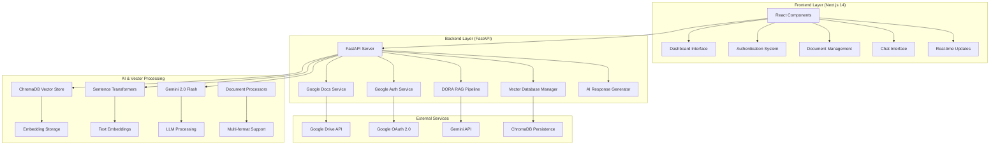
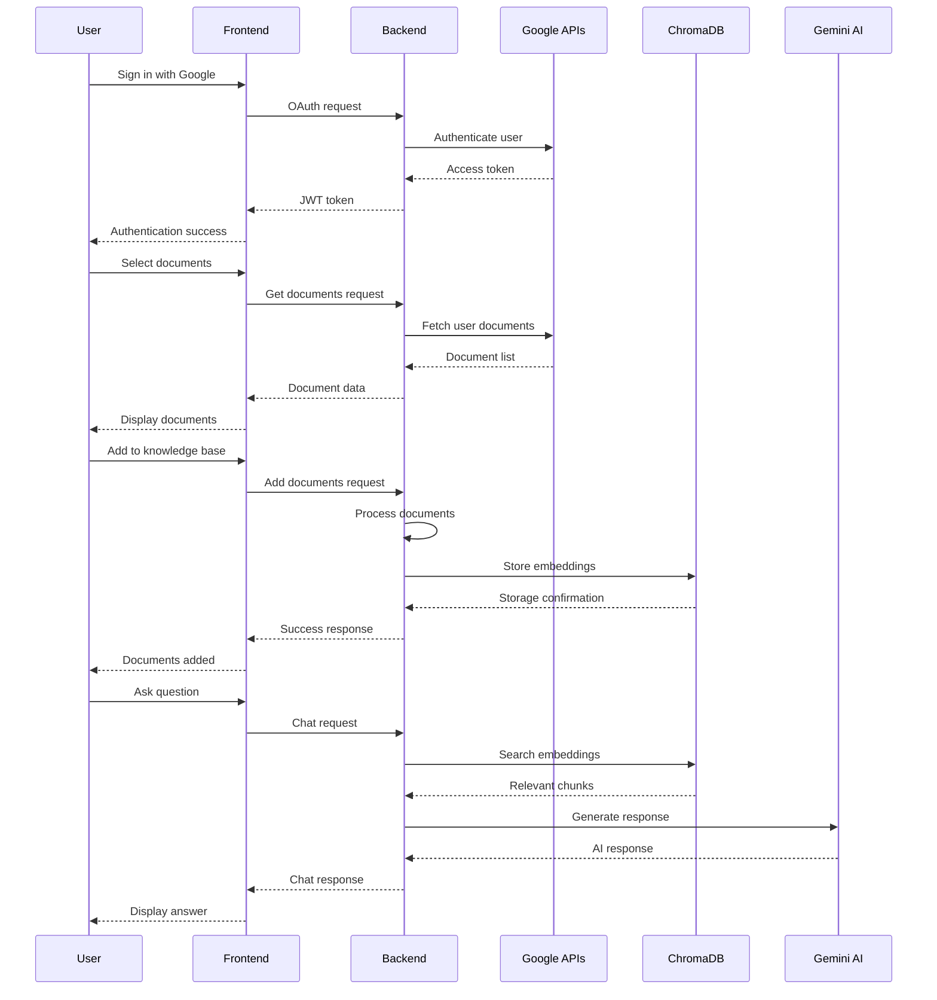

# 🚀 **DORA** - Document Retrieval Assistant

<div align="center">


**An intelligent AI-powered document retrieval system that revolutionizes how you access and understand your documents through advanced RAG (Retrieval-Augmented Generation) technology.**

[](https://nextjs.org/)
[](https://fastapi.tiangolo.com/)
[](https://www.typescriptlang.org/)
[](https://python.org/)
[](https://www.trychroma.com/)
[](https://ai.google.dev/)

[](https://opensource.org/licenses/MIT)
[](https://github.com/suryahanjaya/lenrag)
[](https://github.com/suryahanjaya/lenrag)

</div>

---

## 🎯 **What is DORA?**

**DORA** (Document Retrieval Assistant) is a cutting-edge AI-powered system that transforms how you interact with your documents. Built with state-of-the-art technology, DORA combines Google Drive integration, advanced AI processing, and semantic search to provide instant, accurate answers from your document collection.

### 🌟 **Why DORA?**

- **⚡ Lightning Fast**: Get answers in seconds, not hours
- **🎯 Precise Results**: AI-powered semantic search finds exactly what you need
- **🔒 Secure**: Enterprise-grade security with Google OAuth 2.0
- **📚 Multi-format Support**: Works with Google Docs, PDFs, DOCX, PPTX, and more
- **🌐 Smart Fallback**: General knowledge when your docs don't have the answer
- **💬 Natural Language**: Ask questions in plain English
- **🔄 Real-time Processing**: Instant document ingestion and indexing
- **📊 Advanced Analytics**: Document insights and usage statistics

---

## 🏗️ **Architecture Overview**

<div align="center">



</div>

---

## 🛠️ **Complete Technology Stack**

### 🎨 **Frontend Technologies**

| Technology | Version | Purpose | Why We Use It |
|------------|---------|---------|---------------|
| **Next.js** | 14.2+ | React Framework | ⚡ Server-side rendering, API routes, optimized performance, built-in optimizations |
| **React** | 18+ | UI Library | 🎯 Component-based architecture, hooks, state management, virtual DOM |
| **TypeScript** | 5.0+ | Type Safety | 🔒 Static typing, better IDE support, fewer runtime errors, enhanced developer experience |
| **Tailwind CSS** | 3.3+ | Styling Framework | 🎨 Utility-first CSS, responsive design, rapid development, consistent design system |
| **Radix UI** | Latest | Component Library | ♿ Accessible, unstyled, composable components, keyboard navigation |
| **Lucide React** | 0.292+ | Icon Library | 🎯 Beautiful, customizable SVG icons, tree-shakable, consistent design |

### ⚙️ **Backend Technologies**

| Technology | Version | Purpose | Why We Use It |
|------------|---------|---------|---------------|
| **FastAPI** | 0.104+ | Web Framework | 🚀 High performance, automatic API docs, type hints, async support, OpenAPI |
| **Python** | 3.11+ | Programming Language | 🐍 Rich ecosystem, AI/ML libraries, readability, extensive library support |
| **Uvicorn** | 0.24+ | ASGI Server | ⚡ High-performance async server, production-ready, WebSocket support |
| **Pydantic** | 2.5+ | Data Validation | 🔒 Automatic validation, serialization, type safety, JSON schema generation |

### 🤖 **AI & Machine Learning Stack**

| Technology | Version | Purpose | Why We Use It |
|------------|---------|---------|---------------|
| **ChromaDB** | 0.4.18+ | Vector Database | 🎯 Optimized for embeddings, persistent storage, scalability, similarity search |
| **Sentence Transformers** | 2.2.2+ | Embedding Model | 🧠 State-of-the-art semantic search, multilingual support, optimized performance |
| **Gemini 2.0 Flash** | Latest | Large Language Model | 🚀 Google's latest AI model, fast responses, high accuracy, multimodal support |
| **Google Generative AI** | 0.3.0+ | AI SDK | 🔗 Official Google AI integration, seamless API access, optimized for Gemini |

### 🔐 **Authentication & Security**

| Technology | Version | Purpose | Why We Use It |
|------------|---------|---------|---------------|
| **Google OAuth 2.0** | Latest | Authentication | 🔒 Industry standard, secure, trusted by users, seamless Google integration |
| **JWT Tokens** | Latest | Session Management | 🎯 Stateless, scalable, secure, cross-platform compatibility |
| **HTTP Bearer** | Latest | Token Authentication | 🔐 Secure token transmission, standard protocol, easy implementation |

### 📄 **Document Processing & File Handling**

| Technology | Version | Purpose | Why We Use It |
|------------|---------|---------|---------------|
| **Google Drive API** | Latest | Document Access | 📁 Seamless Google Docs integration, real-time sync, permission management |
| **PyPDF** | 3.17.1+ | PDF Processing | 📄 Extract text from PDF documents, metadata extraction, password support |
| **python-docx** | 1.1.0+ | Word Processing | 📝 Handle DOCX files, preserve formatting, extract text and metadata |
| **BeautifulSoup4** | 4.12.2+ | HTML Parsing | 🌐 Parse web content and HTML documents, extract clean text |
| **TikToken** | 0.5.2+ | Tokenization | 🔤 Efficient text tokenization for AI models, OpenAI compatibility |
| **openpyxl** | 3.1.2+ | Excel Processing | 📊 Handle Excel files, extract data from spreadsheets |

### ☁️ **Deployment & Infrastructure**

| Service | Purpose | Why We Use It |
|---------|---------|---------------|
| **Docker** | Containerization | 📦 Consistent environments, easy deployment, scalability |
| **Docker Compose** | Orchestration | 🔄 Multi-service management, development environment |
| **Vercel** | Frontend Hosting | ⚡ Global CDN, zero-config deployment, automatic scaling |
| **Render** | Backend Hosting | 🚀 Auto-deploy, managed infrastructure, database integration |

---

## 🚀 **Key Features & Capabilities**

### 🔐 **Advanced Authentication & Security**
- **Google OAuth 2.0**: Secure, industry-standard authentication
- **JWT Token Management**: Stateless, secure session management
- **Role-based Access Control**: Fine-grained permissions
- **Data Encryption**: End-to-end encryption for sensitive data
- **Secure API Endpoints**: Protected routes with authentication middleware

### 📁 **Comprehensive Document Management**
- **Google Drive Integration**: Seamless access to your documents
- **Multi-format Support**: Google Docs, PDFs, DOCX, PPTX, TXT, Excel
- **Smart Organization**: Automatic categorization and tagging
- **Version Control**: Track document changes over time
- **Bulk Upload**: Add multiple documents at once
- **Folder Support**: Import entire Google Drive folders
- **Real-time Sync**: Automatic updates when documents change

### 🤖 **AI-Powered Search & Retrieval**
- **Semantic Search**: Find documents by meaning, not just keywords
- **Contextual Understanding**: AI understands domain-specific terminology
- **Multi-language Support**: Works in multiple languages
- **Smart Filtering**: Advanced search filters and sorting
- **Vector Embeddings**: High-dimensional semantic representations
- **Similarity Scoring**: Ranked results based on relevance

### 💬 **Intelligent Chat System**
- **Natural Language Processing**: Ask questions in plain English
- **Contextual Responses**: Answers based on your specific documents
- **Source Attribution**: Always know where answers come from
- **Conversation History**: Keep track of your research
- **Smart Fallback**: General knowledge when documents don't have answers
- **Real-time Streaming**: Live response generation

### 🔄 **Advanced RAG Pipeline**
- **Document Chunking**: Intelligent text segmentation
- **Embedding Generation**: High-quality vector representations
- **Vector Storage**: Persistent, scalable vector database
- **Retrieval Optimization**: Advanced similarity search algorithms
- **Context Assembly**: Smart context preparation for AI models

---

## 📋 **System Requirements**

### 🖥️ **Development Environment**
- **Node.js**: 16.0 or higher
- **Python**: 3.11 or higher
- **Git**: Latest version
- **Docker**: 20.0 or higher (optional)
- **Memory**: 8GB RAM minimum (16GB recommended)
- **Storage**: 10GB free space minimum

### ☁️ **Cloud Services Required**
- **Google Cloud Console**: Project with APIs enabled
- **Gemini API**: API key for AI functionality
- **Google Drive**: Access to documents (via OAuth)

### 🔑 **API Keys & Credentials**
- Google OAuth Client ID & Secret
- Gemini API Key
- Google Drive API access

---

## 🚀 **Complete Installation Guide**

### 1️⃣ **Clone the Repository**

```bash
# Clone the repository
git clone https://github.com/suryahanjaya/lenrag.git
cd lenrag

# Check the project structure
ls -la
```

### 2️⃣ **Google Cloud Platform Setup**

#### Step 1: Create Google Cloud Project
1. Go to [Google Cloud Console](https://console.cloud.google.com/)
2. Create a new project or select existing one
3. Enable the following APIs:
   - Google Drive API
   - Google Docs API
   - Google+ API (for profile information)

#### Step 2: Configure OAuth 2.0
1. Navigate to "Credentials" → "Create Credentials" → "OAuth 2.0 Client IDs"
2. Application type: "Web application"
3. Authorized redirect URIs:
   - `http://localhost:3000/auth/callback` (development)
   - `https://yourdomain.com/auth/callback` (production)
4. Copy Client ID and Client Secret

#### Step 3: Get Gemini API Key
1. Go to [Google AI Studio](https://aistudio.google.com/)
2. Create a new API key
3. Copy the key for environment variables

### 3️⃣ **Environment Configuration**

#### Frontend Environment (`.env.local`)

```bash
# Copy the example file
cp env.local.example .env.local

# Edit with your values
NEXT_PUBLIC_GOOGLE_CLIENT_ID=your_google_client_id
NEXT_PUBLIC_GOOGLE_CLIENT_SECRET=your_google_client_secret
NEXT_PUBLIC_BACKEND_URL=http://localhost:8000
NEXT_PUBLIC_SUPABASE_URL=your_supabase_url
NEXT_PUBLIC_SUPABASE_ANON_KEY=your_supabase_anon_key
```

#### Backend Environment (`.env`)

```bash
# Copy the example file
cd backend
cp env.example .env

# Edit with your values
GOOGLE_CLIENT_ID=your_google_client_id
GOOGLE_CLIENT_SECRET=your_google_client_secret
GEMINI_API_KEY=your_gemini_api_key
SUPABASE_URL=your_supabase_url
SUPABASE_ANON_KEY=your_supabase_anon_key
SUPABASE_SERVICE_ROLE_KEY=your_supabase_service_role_key
ENVIRONMENT=development
```

### 4️⃣ **Backend Setup**

```bash
# Navigate to backend directory
cd backend

# Create virtual environment
python -m venv venv

# Activate virtual environment
# On Windows:
venv\Scripts\activate
# On macOS/Linux:
source venv/bin/activate

# Install dependencies
pip install -r requirements.txt

# Start the backend server
python main.py
# Alternative: uvicorn main:app --reload --host 0.0.0.0 --port 8000
```

### 5️⃣ **Frontend Setup**

```bash
# Navigate to root directory
cd ..

# Install dependencies
npm install

# Start the development server
npm run dev
```

### 6️⃣ **Access the Application**

- **Frontend**: [http://localhost:3000](http://localhost:3000)
- **Backend API**: [http://localhost:8000](http://localhost:8000)
- **API Documentation**: [http://localhost:8000/docs](http://localhost:8000/docs)
- **Interactive API**: [http://localhost:8000/redoc](http://localhost:8000/redoc)

---

## 🎯 **How DORA Works**

<div align="center">



</div>

### 🔄 **DORA RAG Pipeline Process**

#### 1. **Document Ingestion Phase**
- User selects documents from Google Drive
- Documents are processed and chunked intelligently
- Text embeddings are generated using Sentence Transformers
- Embeddings are stored in ChromaDB vector database
- Metadata is preserved for source attribution

#### 2. **Query Processing Phase**
- User asks a question in natural language
- Question is converted to embedding vector
- Similarity search finds relevant document chunks
- Context is prepared for AI model
- Source documents are identified

#### 3. **Response Generation Phase**
- Gemini 2.0 Flash processes the context and question
- AI generates contextual response based on documents
- If no relevant documents found, fallback to general knowledge
- Response includes source attribution and confidence scores

---

## 🐳 **Docker Deployment**

### **Complete Docker Setup**

```bash
# Build and start all services
docker-compose up --build

# Run in background
docker-compose up -d --build

# View logs
docker-compose logs -f

# Stop services
docker-compose down
```

### **Individual Container Build**

#### Backend Container:
```bash
docker build -f Dockerfile.backend -t dora-backend .
docker run -p 8000:8000 dora-backend
```

#### Frontend Container:
```bash
docker build -f Dockerfile.frontend -t dora-frontend .
docker run -p 3000:3000 dora-frontend
```

### **Production Docker Configuration**

```yaml
# docker-compose.prod.yml
version: '3.8'
services:
  backend:
    build:
      context: .
      dockerfile: Dockerfile.backend
    ports:
      - "8000:8000"
    environment:
      - ENVIRONMENT=production
    volumes:
      - chroma_db:/app/chroma_db
    restart: unless-stopped
    deploy:
      resources:
        limits:
          memory: 2G
        reservations:
          memory: 1G

  frontend:
    build:
      context: .
      dockerfile: Dockerfile.frontend
    ports:
      - "3000:3000"
    depends_on:
      - backend
    restart: unless-stopped

volumes:
  chroma_db:
```

---

## 🚀 **Production Deployment**

### **Vercel (Frontend Deployment)**

1. **Connect Repository**
   - Connect your GitHub repository to Vercel
   - Set framework preset to Next.js

2. **Environment Variables**
   ```
   NEXT_PUBLIC_GOOGLE_CLIENT_ID=your_client_id
   NEXT_PUBLIC_GOOGLE_CLIENT_SECRET=your_client_secret
   NEXT_PUBLIC_BACKEND_URL=https://your-backend-url.com
   NEXT_PUBLIC_SUPABASE_URL=your_supabase_url
   NEXT_PUBLIC_SUPABASE_ANON_KEY=your_supabase_anon_key
   ```

3. **Deployment Settings**
   - Root Directory: `.` (root)
   - Build Command: `npm run build`
   - Output Directory: `.next`

### **Render (Backend Deployment)**

1. **Connect Repository**
   - Connect your GitHub repository to Render
   - Create a new Web Service

2. **Configuration**
   - Root Directory: `backend`
   - Build Command: `pip install -r requirements.txt`
   - Start Command: `python main.py`
   - Environment: Python 3.11

3. **Environment Variables**
   ```
   GOOGLE_CLIENT_ID=your_client_id
   GOOGLE_CLIENT_SECRET=your_client_secret
   GEMINI_API_KEY=your_gemini_api_key
   SUPABASE_URL=your_supabase_url
   SUPABASE_SERVICE_ROLE_KEY=your_service_role_key
   ENVIRONMENT=production
   ```

### **Alternative: Railway Deployment**

1. **Install Railway CLI**
   ```bash
   npm install -g @railway/cli
   railway login
   ```

2. **Deploy Backend**
   ```bash
   cd backend
   railway init
   railway up
   ```

3. **Deploy Frontend**
   ```bash
   cd ..
   railway init
   railway up
   ```

---

## 📚 **Complete API Documentation**

### **Authentication Endpoints**

| Method | Endpoint | Description | Request Body | Response |
|--------|----------|-------------|--------------|----------|
| `POST` | `/auth/google` | Google OAuth authentication | `{ "code": "string" }` | `{ "access_token": "string", "user": {...} }` |
| `GET` | `/health` | Health check | - | `{ "status": "healthy" }` |

### **Document Management Endpoints**

| Method | Endpoint | Description | Request Body | Response |
|--------|----------|-------------|--------------|----------|
| `GET` | `/documents` | List user documents | - | `{ "documents": [...] }` |
| `POST` | `/documents/add` | Add documents to knowledge base | `{ "document_ids": [...] }` | `{ "success": true, "added": [...] }` |
| `DELETE` | `/documents/{id}` | Remove document from knowledge base | - | `{ "success": true }` |
| `GET` | `/documents/folders` | Get documents from Google Drive folder | `{ "folder_url": "string" }` | `{ "documents": [...] }` |

### **Chat & AI Endpoints**

| Method | Endpoint | Description | Request Body | Response |
|--------|----------|-------------|--------------|----------|
| `POST` | `/chat` | Chat with documents | `{ "message": "string" }` | `{ "response": "string", "sources": [...] }` |
| `GET` | `/debug/knowledge-base` | Debug knowledge base content | - | `{ "collections": [...] }` |

### **User Management Endpoints**

| Method | Endpoint | Description | Request Body | Response |
|--------|----------|-------------|--------------|----------|
| `GET` | `/user/profile` | Get user profile | - | `{ "user": {...} }` |

---

## 🔍 **Troubleshooting & Debug Guide**

### **Common Issues & Solutions**

#### 1. **Authentication Failed**
**Symptoms**: OAuth redirect not working, authentication errors
**Solutions**:
- Check Google Cloud Console redirect URI: `http://localhost:3000/auth/callback`
- Ensure APIs are enabled (Drive, Docs, Google+)
- Verify client ID and secret in environment variables
- Check CORS settings in backend

#### 2. **Documents Not Loading**
**Symptoms**: Empty document list, API errors
**Solutions**:
- Check Google Drive API permissions
- Verify access token is valid
- Ensure proper scopes are requested
- Check network connectivity

#### 3. **Chat Not Working**
**Symptoms**: No AI responses, errors in chat
**Solutions**:
- Check Gemini API key validity
- Verify documents are added to knowledge base
- Check backend logs for errors
- Ensure sufficient API quota

#### 4. **Vector Database Issues**
**Symptoms**: Embeddings not stored, search not working
**Solutions**:
- Ensure ChromaDB is properly initialized
- Check disk space for vector storage
- Verify embedding model is loaded correctly
- Check collection permissions

### **Debug Endpoints**

- `/debug` - OAuth configuration debug
- `/debug-auth` - Authentication status and token testing
- `/debug/knowledge-base` - Vector database content inspection

### **Performance Optimization**

#### 1. **Chunk Size Optimization**
- Default: 1500 characters per chunk
- Overlap: 150 characters for better context
- Adjust based on document type and size
- Legal documents: 2000 characters
- Technical docs: 1000 characters

#### 2. **Embedding Model Configuration**
- Using `all-MiniLM-L6-v2` for balance of speed and accuracy
- Supports 384-dimensional embeddings
- Optimized for semantic similarity
- Multilingual support included

#### 3. **Vector Database Optimization**
- ChromaDB with cosine similarity
- Persistent storage for scalability
- User-specific collections for privacy
- Automatic cleanup of old embeddings

---

## 🧪 **Testing & Quality Assurance**

### **Frontend Testing**
```bash
# Run TypeScript checks
npm run type-check

# Run ESLint
npm run lint

# Run build test
npm run build
```

### **Backend Testing**
```bash
# Run Python tests
python -m pytest tests/

# Check code quality
flake8 backend/
black backend/
```

### **Integration Testing**
```bash
# Test API endpoints
curl -X GET http://localhost:8000/health

# Test authentication
curl -X POST http://localhost:8000/auth/google \
  -H "Content-Type: application/json" \
  -d '{"code": "test_code"}'
```

---

## 🤝 **Contributing Guidelines**

### **Development Workflow**

1. **Fork the Repository**
   ```bash
   git fork https://github.com/suryahanjaya/lenrag.git
   ```

2. **Create Feature Branch**
   ```bash
   git checkout -b feature/amazing-feature
   ```

3. **Make Changes**
   - Follow TypeScript best practices
   - Write comprehensive tests
   - Update documentation
   - Follow existing code style

4. **Commit Changes**
   ```bash
   git commit -m 'Add amazing feature'
   ```

5. **Push and Create PR**
   ```bash
   git push origin feature/amazing-feature
   ```

### **Code Standards**

- **TypeScript**: Strict mode enabled, comprehensive type definitions
- **Python**: PEP 8 compliance, type hints required
- **Testing**: Minimum 80% code coverage
- **Documentation**: Update README for new features
- **Error Handling**: Comprehensive error handling and logging

---

## 📝 **License & Legal**

This project is licensed under the MIT License - see the [LICENSE](LICENSE) file for details.

### **Third-party Licenses**
- Next.js: MIT License
- FastAPI: MIT License
- ChromaDB: Apache 2.0 License
- Google AI: Google Terms of Service

---

## 🙏 **Acknowledgments**

### **Open Source Libraries**
- **Google APIs** for document integration and authentication
- **Gemini AI** for intelligent response generation
- **ChromaDB** for vector storage and similarity search
- **Next.js and FastAPI** communities for excellent frameworks
- **Sentence Transformers** for embedding generation

### **Original Inspiration**
- **Repository**: [codemet-rag-chatbot](https://github.com/santoshnaya/codemet-rag-chatbot) by [santoshnaya](https://github.com/santoshnaya)
- **Concept**: RAG-based document retrieval systems
- **Community**: AI and ML open source contributors

---

## 📞 **Support & Contact**

### **Getting Help**

If you encounter any issues or have questions:

1. **Check Documentation**: Review this README thoroughly
2. **Search Issues**: Look through [GitHub Issues](https://github.com/suryahanjaya/lenrag/issues)
3. **Create Issue**: Open a new issue with detailed information
4. **Include Details**: Error logs, environment details, steps to reproduce

### **Issue Template**
```markdown
**Describe the bug**
A clear description of what the bug is.

**To Reproduce**
Steps to reproduce the behavior:
1. Go to '...'
2. Click on '....'
3. See error

**Expected behavior**
What you expected to happen.

**Environment**
- OS: [e.g. Windows 10, macOS 12, Ubuntu 20.04]
- Node.js version: [e.g. 18.0.0]
- Python version: [e.g. 3.11.0]
- Browser: [e.g. Chrome 120, Firefox 119]

**Additional context**
Add any other context about the problem here.
```

---

## 🔗 **Connect with the Developer**

<div align="center">

### **Surya Hanjaya**
*Full-Stack Developer & AI Enthusiast*

[](https://www.linkedin.com/in/surya-hanjaya/)
[](https://github.com/suryahanjaya?tab=repositories)
[](https://www.instagram.com/h4njy/)

**About the Developer:**
- 🚀 Passionate about AI and Machine Learning
- 💻 Full-Stack Developer with expertise in React, Python, and AI
- 🌟 Open Source Contributor and Tech Enthusiast
- 📚 Continuous learner in emerging technologies
- 🤝 Always open to collaboration and new opportunities

</div>

---

## 🎯 **Project Roadmap**

### **Current Version: 2.0.0**
- ✅ Google Drive Integration
- ✅ Multi-format Document Support
- ✅ Advanced RAG Pipeline
- ✅ Real-time Chat Interface
- ✅ Vector Database Storage

### **Upcoming Features**
- 🔄 **Version 2.1.0**: Advanced Analytics Dashboard
- 🔄 **Version 2.2.0**: Multi-language Support
- 🔄 **Version 2.3.0**: Team Collaboration Features
- 🔄 **Version 2.4.0**: Mobile Application
- 🔄 **Version 3.0.0**: Enterprise Features

---

**Built with ❤️ using FastAPI, Next.js, and Google AI**

<div align="center">


</div>