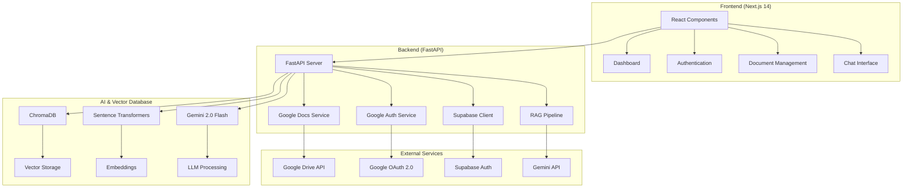
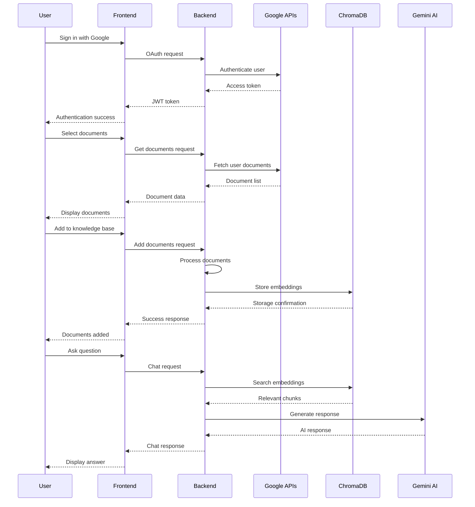

# 🚀 **Lara** - Legal RAG Assistant

<div align="center">


**A powerful Retrieval-Augmented Generation (RAG) system designed to simplify the process of finding relevant laws and legal regulations.**

[](https://nextjs.org/)
[](https://fastapi.tiangolo.com/)
[](https://www.typescriptlang.org/)
[](https://python.org/)
[](https://www.trychroma.com/)
[](https://ai.google.dev/)

[](https://opensource.org/licenses/MIT)
[](https://github.com/suryahanjaya/lenrag)
[](https://github.com/suryahanjaya/lenrag)

</div>

---

## 🎯 **What is Lara?**

**Lara** (Legal RAG Assistant) is an intelligent AI-powered system that revolutionizes how legal professionals and researchers access and understand legal documents. Built with cutting-edge technology, Lara combines the power of Google Drive integration, advanced AI processing, and semantic search to provide instant, accurate answers from your legal document collection.

### 🌟 **Why Lara?**

- **⚡ Lightning Fast**: Get answers in seconds, not hours
- **🎯 Precise Results**: AI-powered semantic search finds exactly what you need
- **🔒 Secure**: Enterprise-grade security with Google OAuth 2.0
- **📚 Multi-format Support**: Works with Google Docs, PDFs, DOCX, and more
- **🌐 Smart Fallback**: General knowledge when your docs don't have the answer
- **💬 Natural Language**: Ask questions in plain English

---

## 🏗️ **Architecture Overview**

<div align="center">



</div>

---

## 🛠️ **Technology Stack**

### 🎨 **Frontend Technologies**

| Technology | Version | Purpose | Why We Use It |
|------------|---------|---------|---------------|
| **Next.js** | 14.2+ | React Framework | ⚡ Server-side rendering, API routes, optimized performance |
| **React** | 18+ | UI Library | 🎯 Component-based architecture, hooks, state management |
| **TypeScript** | 5.0+ | Type Safety | 🔒 Static typing, better IDE support, fewer runtime errors |
| **Tailwind CSS** | 3.3+ | Styling | 🎨 Utility-first CSS, responsive design, rapid development |
| **Radix UI** | Latest | Component Library | ♿ Accessible, unstyled, composable components |
| **Lucide React** | 0.292+ | Icons | 🎯 Beautiful, customizable SVG icons |

### ⚙️ **Backend Technologies**

| Technology | Version | Purpose | Why We Use It |
|------------|---------|---------|---------------|
| **FastAPI** | 0.104+ | Web Framework | 🚀 High performance, automatic API docs, type hints |
| **Python** | 3.8+ | Programming Language | 🐍 Rich ecosystem, AI/ML libraries, readability |
| **Uvicorn** | 0.24+ | ASGI Server | ⚡ High-performance async server |
| **Pydantic** | 2.5+ | Data Validation | 🔒 Automatic validation, serialization, type safety |

### 🤖 **AI & Machine Learning**

| Technology | Version | Purpose | Why We Use It |
|------------|---------|---------|---------------|
| **ChromaDB** | 0.4.18+ | Vector Database | 🎯 Optimized for embeddings, persistent storage, scalability |
| **Sentence Transformers** | 2.2.2+ | Embeddings | 🧠 State-of-the-art semantic search, multilingual support |
| **Gemini 2.0 Flash** | Latest | Large Language Model | 🚀 Google's latest AI model, fast responses, high accuracy |
| **Google Generative AI** | 0.3.0+ | AI SDK | 🔗 Official Google AI integration |

### 🔐 **Authentication & Security**

| Technology | Version | Purpose | Why We Use It |
|------------|---------|---------|---------------|
| **Google OAuth 2.0** | Latest | Authentication | 🔒 Industry standard, secure, trusted by users |
| **JWT Tokens** | Latest | Session Management | 🎯 Stateless, scalable, secure |
| **Supabase** | 2.0.2+ | Backend-as-a-Service | 🚀 User management, real-time features, PostgreSQL |

### 📄 **Document Processing**

| Technology | Version | Purpose | Why We Use It |
|------------|---------|---------|---------------|
| **Google Drive API** | Latest | Document Access | 📁 Seamless Google Docs integration |
| **PyPDF** | 3.17.1+ | PDF Processing | 📄 Extract text from PDF documents |
| **python-docx** | 1.1.0+ | Word Processing | 📝 Handle DOCX files |
| **BeautifulSoup4** | 4.12.2+ | HTML Parsing | 🌐 Parse web content and HTML documents |
| **TikToken** | 0.5.2+ | Tokenization | 🔤 Efficient text tokenization for AI models |

### ☁️ **Deployment & Infrastructure**

| Service | Purpose | Why We Use It |
|---------|---------|---------------|
| **Vercel** | Frontend Hosting | ⚡ Global CDN, zero-config deployment |
| **Render** | Backend Hosting | 🚀 Auto-deploy, managed infrastructure |
| **Docker** | Containerization | 📦 Consistent environments, easy deployment |

---

## 🚀 **Key Features**

### 🔐 **Authentication & Security**
- **Google OAuth 2.0**: Secure, industry-standard authentication
- **JWT Tokens**: Stateless, secure session management
- **Role-based Access**: Fine-grained permissions
- **Data Encryption**: End-to-end encryption for sensitive data

### 📁 **Document Management**
- **Google Drive Integration**: Seamless access to your documents
- **Multi-format Support**: Google Docs, PDFs, DOCX, TXT, PPTX
- **Smart Organization**: Automatic categorization and tagging
- **Version Control**: Track document changes over time
- **Bulk Upload**: Add multiple documents at once
- **Folder Support**: Import entire Google Drive folders

### 🤖 **AI-Powered Search**
- **Semantic Search**: Find documents by meaning, not just keywords
- **Contextual Understanding**: AI understands legal terminology
- **Multi-language Support**: Works in multiple languages
- **Smart Filtering**: Advanced search filters and sorting
- **Vector Embeddings**: High-dimensional semantic representations

### 💬 **Intelligent Chat**
- **Natural Language Processing**: Ask questions in plain English
- **Contextual Responses**: Answers based on your specific documents
- **Source Attribution**: Always know where answers come from
- **Conversation History**: Keep track of your research
- **Smart Fallback**: General knowledge when documents don't have answers

---

## 📋 **Prerequisites**

### 🖥️ **System Requirements**
- **Node.js**: 16.0 or higher
- **Python**: 3.8 or higher
- **Git**: Latest version
- **Docker**: 20.0 or higher (optional)

### ☁️ **Cloud Services**
- **Google Cloud Console**: Project with APIs enabled
- **Gemini API**: API key for AI functionality
- **Supabase**: Account (optional, for advanced features)

### 🔑 **API Keys Required**
- Google OAuth Client ID & Secret
- Gemini API Key
- Supabase URL & Keys (optional)

---

## 🚀 **Quick Start Guide**

### 1️⃣ **Clone the Repository**

```bash
# Clone the repository
git clone https://github.com/suryahanjaya/lenrag.git
cd lenrag

# Check the structure
ls -la
```

### 2️⃣ **Google Cloud Setup**

1. **Create Google Cloud Project**
   - Go to [Google Cloud Console](https://console.cloud.google.com/)
   - Create a new project or select existing one
   - Enable the following APIs:
     - Google Drive API
     - Google Docs API
     - Google+ API (for profile information)

2. **Configure OAuth 2.0**
   - Go to "Credentials" → "Create Credentials" → "OAuth 2.0 Client IDs"
   - Application type: "Web application"
   - Authorized redirect URIs:
     - `http://localhost:3000/auth/callback` (development)
     - `https://yourdomain.com/auth/callback` (production)

3. **Get Gemini API Key**
   - Go to [Google AI Studio](https://aistudio.google.com/)
   - Create a new API key
   - Copy the key for environment variables

### 3️⃣ **Environment Configuration**

#### Frontend Environment (`.env.local`)

```bash
# Copy the example file
cp env.local.example .env.local

# Edit the file with your values
NEXT_PUBLIC_GOOGLE_CLIENT_ID=your_google_client_id
NEXT_PUBLIC_GOOGLE_CLIENT_SECRET=your_google_client_secret
NEXT_PUBLIC_BACKEND_URL=http://localhost:8000
NEXT_PUBLIC_SUPABASE_URL=your_supabase_url
NEXT_PUBLIC_SUPABASE_ANON_KEY=your_supabase_anon_key
```

#### Backend Environment (`.env`)

```bash
# Copy the example file
cd backend
cp env.example .env

# Edit the file with your values
GOOGLE_CLIENT_ID=your_google_client_id
GOOGLE_CLIENT_SECRET=your_google_client_secret
GEMINI_API_KEY=your_gemini_api_key
SUPABASE_URL=your_supabase_url
SUPABASE_ANON_KEY=your_supabase_anon_key
SUPABASE_SERVICE_ROLE_KEY=your_supabase_service_role_key
```

### 4️⃣ **Backend Setup**

```bash
# Navigate to backend directory
cd backend

# Create virtual environment
python -m venv venv

# Activate virtual environment
# On Windows:
venv\Scripts\activate
# On macOS/Linux:
source venv/bin/activate

# Install dependencies
pip install -r requirements.txt

# Start the backend server
python main.py
```

### 5️⃣ **Frontend Setup**

```bash
# Navigate to root directory
cd ..

# Install dependencies
npm install

# Start the development server
npm run dev
```

### 6️⃣ **Access the Application**

- **Frontend**: [http://localhost:3000](http://localhost:3000)
- **Backend API**: [http://localhost:8000](http://localhost:8000)
- **API Documentation**: [http://localhost:8000/docs](http://localhost:8000/docs)

---

## 🎯 **How It Works**

<div align="center">



</div>

### 🔄 **RAG Pipeline Process**

1. **Document Ingestion**
   - User selects documents from Google Drive
   - Documents are processed and chunked
   - Text embeddings are generated using Sentence Transformers
   - Embeddings are stored in ChromaDB vector database

2. **Query Processing**
   - User asks a question in natural language
   - Question is converted to embedding vector
   - Similarity search finds relevant document chunks
   - Context is prepared for AI model

3. **Response Generation**
   - Gemini 2.0 Flash processes the context and question
   - AI generates contextual response based on documents
   - If no relevant documents found, fallback to general knowledge
   - Response includes source attribution

---

## 🐳 **Docker Deployment**

### Build and Run with Docker Compose:

```bash
# Build and start all services
docker-compose up --build

# Run in background
docker-compose up -d --build
```

### Individual Container Build:

#### Backend:

```bash
docker build -f Dockerfile.backend -t rag-chatbot-backend .
docker run -p 8000:8000 rag-chatbot-backend
```

#### Frontend:

```bash
docker build -f Dockerfile.frontend -t rag-chatbot-frontend .
docker run -p 3000:3000 rag-chatbot-frontend
```

---

## 🚀 **Production Deployment**

### Render (Backend)

1. Connect your GitHub repository to Render
2. Set the following configuration:  
   * **Root Directory**: `backend`  
   * **Build Command**: `pip install -r requirements.txt`  
   * **Start Command**: `python main.py`  
   * **Environment Variables**: Add all backend environment variables

### Vercel (Frontend)

1. Connect your GitHub repository to Vercel
2. Set the following configuration:  
   * **Framework Preset**: Next.js  
   * **Root Directory**: `.` (root)  
   * **Build Command**: `npm run build`  
   * **Environment Variables**: Add all frontend environment variables

---

## 📚 **API Endpoints**

### Authentication

| Method | Endpoint | Description |
|--------|----------|-------------|
| `POST` | `/auth/google` | Google OAuth authentication |
| `GET` | `/health` | Health check |

### Documents

| Method | Endpoint | Description |
|--------|----------|-------------|
| `GET` | `/documents` | List user documents |
| `POST` | `/documents/add` | Add documents to knowledge base |
| `DELETE` | `/documents/{id}` | Remove document from knowledge base |
| `GET` | `/documents/folders` | Get documents from Google Drive folder |

### Chat

| Method | Endpoint | Description |
|--------|----------|-------------|
| `POST` | `/chat` | Chat with documents |
| `GET` | `/debug/knowledge-base` | Debug knowledge base content |

### User

| Method | Endpoint | Description |
|--------|----------|-------------|
| `GET` | `/user/profile` | Get user profile |

---

## 🔍 **Troubleshooting**

### Common Issues

1. **Authentication Failed**  
   * Check Google Cloud Console redirect URI: `http://localhost:3000/auth/callback`  
   * Ensure APIs are enabled (Drive, Docs, Google+)  
   * Verify client ID and secret in environment variables

2. **Documents Not Loading**  
   * Check Google Drive API permissions  
   * Verify access token is valid  
   * Ensure proper scopes are requested

3. **Chat Not Working**  
   * Check Gemini API key  
   * Verify documents are added to knowledge base  
   * Check backend logs for errors

4. **Vector Database Issues**
   * Ensure ChromaDB is properly initialized
   * Check disk space for vector storage
   * Verify embedding model is loaded correctly

### Debug Pages

* `/debug` - OAuth configuration debug
* `/debug-auth` - Authentication status and token testing

### Performance Optimization

1. **Chunk Size Optimization**
   - Default: 1500 characters per chunk
   - Overlap: 250 characters for better context
   - Adjust based on document type and size

2. **Embedding Model**
   - Using `all-MiniLM-L6-v2` for balance of speed and accuracy
   - Supports 384-dimensional embeddings
   - Optimized for semantic similarity

3. **Vector Database**
   - ChromaDB with cosine similarity
   - Persistent storage for scalability
   - User-specific collections for privacy

---

## 🤝 **Contributing**

1. Fork the repository
2. Create a feature branch: `git checkout -b feature/amazing-feature`
3. Commit your changes: `git commit -m 'Add amazing feature'`
4. Push to the branch: `git push origin feature/amazing-feature`
5. Open a Pull Request

### Development Guidelines

- Follow TypeScript best practices
- Write comprehensive tests
- Update documentation for new features
- Follow the existing code style
- Add proper error handling

---

## 📝 **License**

This project is licensed under the MIT License - see the [LICENSE](LICENSE) file for details.

---

## 🙏 **Acknowledgments**

* **Google APIs** for document integration
* **Gemini AI** for intelligent responses
* **ChromaDB** for vector storage
* **Next.js and FastAPI** communities
* **Original Repository**: [codemet-rag-chatbot](https://github.com/santoshnaya/codemet-rag-chatbot) by [santoshnaya](https://github.com/santoshnaya)

---

## 📞 **Support & Contact**

If you encounter any issues or have questions:

1. Check the [Issues](https://github.com/suryahanjaya/lenrag/issues) section
2. Create a new issue with detailed information
3. Include error logs and environment details

### 🔗 **Connect with the Developer**

<div align="center">

[](https://www.linkedin.com/in/surya-hanjaya/)
[](https://github.com/suryahanjaya?tab=repositories)
[](https://www.instagram.com/h4njy/)

</div>

---

**Built with ❤️ using FastAPI, Next.js, and Google AI**

<div align="center">


</div>