# 🚀 **DORA** - Document Retrieval Assistant

<div align="center">


**Transform how you interact with documents using cutting-edge AI technology. DORA combines Google Drive integration, advanced RAG pipelines, and state-of-the-art language models to deliver instant, accurate answers from your document collection.**

[](https://nextjs.org/)
[](https://fastapi.tiangolo.com/)
[](https://www.typescriptlang.org/)
[](https://python.org/)
[](https://www.trychroma.com/)
[](https://www.docker.com/)

[](https://opensource.org/licenses/MIT)
[](http://makeapullrequest.com)
[](https://github.com/suryahanjaya/lenrag/graphs/commit-activity)

</div>

---

## 🎯 **What is DORA?**

**DORA** (Document Retrieval Assistant) is an enterprise-grade AI system that revolutionizes document management and knowledge retrieval. Built with modern technologies and optimized for performance, DORA provides:

- **⚡ Lightning-Fast Responses**: Get answers in seconds with optimized parallel processing (60 concurrent fetches, 15 parallel embeddings)
- **🎯 Precision AI Search**: Advanced semantic search using state-of-the-art embedding models
- **🔒 Enterprise Security**: Google OAuth 2.0 with JWT token management
- **📚 Universal Format Support**: Google Docs, PDFs, DOCX, PPTX, TXT, Excel, and more
- **🌐 Intelligent Fallback**: Seamlessly switches to general knowledge when documents lack information
- **💬 Natural Conversations**: Chat in plain English with context-aware AI responses
- **🔄 Real-Time Streaming**: Progressive document loading and live response generation
- **📊 Production-Ready**: Dockerized deployment with optimized configurations

---

## 🏗️ **System Architecture**

```mermaid
graph TB
    subgraph "🎨 Frontend Layer"
        A[Next.js 14 App]
        B[React Components]
        C[TypeScript Logic]
        D[Tailwind CSS Styling]
    end
    
    subgraph "⚙️ Backend Layer"
        E[FastAPI Server]
        F[Google OAuth Service]
        G[Document Processor]
        H[RAG Pipeline Engine]
    end
    
    subgraph "🤖 AI & Vector Layer"
        I[ChromaDB Vector Store]
        J[Sentence Transformers]
        K[Groq/Gemini LLM]
    end
    
    subgraph "☁️ External Services"
        L[Google Drive API]
        M[Google OAuth 2.0]
        N[Groq/Gemini API]
    end
    
    A --> E
    E --> F --> M
    E --> G --> L
    E --> H --> I
    H --> J
    H --> K --> N
```

<div align="center">



</div>

---

## 🛠️ **Complete Technology Stack**

### 🎨 **Frontend Technologies**

| Technology | Version | Purpose | Why We Chose It |
|------------|---------|---------|-----------------|
|  | 14.2+ | **React Framework** | Server-side rendering, API routes, automatic code splitting, optimized performance, and built-in image optimization for blazing-fast page loads |
|  | 18+ | **UI Library** | Component-based architecture, hooks for state management, virtual DOM for efficient updates, and massive ecosystem support |
|  | 5.0+ | **Type Safety** | Catch errors at compile-time, superior IDE support, better refactoring, and enhanced developer experience with IntelliSense |
|  | 3.3+ | **Styling Framework** | Utility-first approach, rapid prototyping, consistent design system, responsive design out-of-the-box, and minimal CSS bundle size |
|  | Latest | **Accessible Components** | Unstyled, accessible primitives, keyboard navigation, ARIA compliance, and full customization control |
|  | 0.292+ | **Icon Library** | Beautiful SVG icons, tree-shakable, consistent design language, and extensive icon collection |

### ⚙️ **Backend Technologies**

| Technology | Version | Purpose | Why We Chose It |
|------------|---------|---------|-----------------|
|  | 0.104+ | **Web Framework** | Async support, automatic API documentation (OpenAPI/Swagger), type validation with Pydantic, high performance (on par with NodeJS), and modern Python features |
|  | 3.11+ | **Programming Language** | Rich AI/ML ecosystem, readable syntax, extensive libraries for document processing, and excellent async capabilities |
|  | 0.24+ | **ASGI Server** | Lightning-fast async server, production-ready, WebSocket support, and optimized for FastAPI |
|  | 2.5+ | **Data Validation** | Automatic request/response validation, JSON schema generation, type safety, and clear error messages |

### 🤖 **AI & Machine Learning Stack**

| Technology | Version | Purpose | Why We Chose It |
|------------|---------|---------|-----------------|
|  | 0.4.22+ | **Vector Database** | Purpose-built for embeddings, persistent storage, lightning-fast similarity search, and scalable architecture for millions of documents |
|  | 2.2.2+ | **Embedding Model** | State-of-the-art semantic understanding, multilingual support, optimized `all-MiniLM-L6-v2` model (384-dim), and excellent speed-accuracy balance |
|  | 0.4.1+ | **LLM Provider** | Ultra-fast inference (14.4K requests/day with Llama 3.1 8B), cost-effective, reliable API, and production-stable performance |
|  | 2.0 Flash | **Alternative LLM** | Google's latest AI model, multimodal capabilities, high accuracy, and seamless integration with Google ecosystem |
|  | 0.3.0+ | **AI SDK** | Official Google AI integration, optimized for Gemini models, and comprehensive API access |

### 🔐 **Authentication & Security**

| Technology | Purpose | Why We Chose It |
|------------|---------|-----------------|
|  | **Authentication** | Industry-standard security, trusted by users worldwide, seamless Google Drive integration, and no password management overhead |
|  | **Session Management** | Stateless authentication, scalable across servers, secure token transmission, and cross-platform compatibility |
|  | **Rate Limiting** | Prevent API abuse, protect against DDoS, configurable limits (60 req/min general, 5 req/min auth), and automatic throttling |

### 📄 **Document Processing**

| Technology | Version | Purpose | Why We Chose It |
|------------|---------|---------|-----------------|
|  | Latest | **Cloud Storage** | Seamless document access, real-time sync, permission management, and native Google Docs support |
|  | 3.17.1+ | **PDF Processing** | Extract text from PDFs, metadata extraction, password-protected file support, and reliable parsing |
|  | 1.1.0+ | **Word Processing** | Handle DOCX files, preserve formatting, extract text and metadata, and comprehensive Word document support |
|  | 0.6.21+ | **PowerPoint Processing** | Extract text from presentations, slide-by-slide processing, and metadata extraction |
|  | 0.5.2+ | **Tokenization** | Efficient text tokenization, OpenAI compatibility, accurate token counting for LLM context management |

### 🐳 **Deployment & Infrastructure**

| Technology | Purpose | Why We Chose It |
|------------|---------|-----------------|
|  | **Containerization** | Consistent environments across dev/prod, easy deployment, isolated dependencies, and reproducible builds |
|  | **Orchestration** | Multi-service management, simplified networking, volume management, and one-command deployment |
|  | **Frontend Hosting** | Global CDN, zero-config deployment, automatic HTTPS, serverless functions, and instant rollbacks |
|  | **Backend Hosting** | Auto-deploy from Git, managed infrastructure, free SSL, database integration, and automatic scaling |

---

## 🚀 **Key Features & How They Work**

### 🔐 **Advanced Authentication System**

**How It Works:**
1. User clicks "Sign in with Google" on the login page
2. Frontend redirects to Google OAuth consent screen
3. User authorizes DORA to access their Google Drive
4. Google returns authorization code to our callback endpoint
5. Backend exchanges code for access token and refresh token
6. Backend creates JWT token with user information
7. Frontend stores JWT and uses it for all subsequent API calls
8. Automatic token refresh when expired (seamless user experience)

**Security Features:**
- ✅ Industry-standard OAuth 2.0 protocol
- ✅ JWT tokens with expiration (30-minute default)
- ✅ Refresh token rotation for extended sessions
- ✅ Secure HTTP-only cookie support (optional)
- ✅ Rate limiting on auth endpoints (5 requests/minute)
- ✅ Token validation on every protected endpoint

### 📁 **Intelligent Document Management**

**How It Works:**
1. **Document Discovery**: User provides Google Drive folder URL or selects from their drive
2. **Parallel Fetching**: System fetches up to 60 documents simultaneously (configurable)
3. **Format Detection**: Automatically identifies file type (Google Docs, PDF, DOCX, etc.)
4. **Content Extraction**: Extracts text content using specialized parsers for each format
5. **Progressive Loading**: Documents appear in UI as they're fetched (real-time streaming)
6. **Metadata Preservation**: Stores document title, URL, type, and modification date

**Supported Formats:**
- 📄 **Google Docs**: Native API integration for perfect text extraction
- 📕 **PDF**: PyPDF for text extraction, handles encrypted PDFs
- 📘 **DOCX**: python-docx for Word documents with formatting preservation
- 📙 **PPTX**: python-pptx for PowerPoint presentations
- 📗 **TXT**: Direct text file reading
- 📊 **Excel**: openpyxl for spreadsheet data extraction
- 🌐 **HTML**: BeautifulSoup4 for web content parsing

### 🤖 **Advanced RAG (Retrieval-Augmented Generation) Pipeline**

**How It Works:**

**Phase 1: Document Ingestion**
1. **Text Chunking**: Documents split into 850-character chunks with 85-character overlap
   - Why 850 chars? Optimal balance between context and processing speed
   - 10% overlap ensures context continuity across chunks
2. **Embedding Generation**: Each chunk converted to 384-dimensional vector using `all-MiniLM-L6-v2`
   - Parallel processing: 15 documents embedded simultaneously
   - GPU acceleration if available (falls back to CPU)
3. **Vector Storage**: Embeddings stored in ChromaDB with metadata
   - User-specific collections for privacy
   - Persistent storage survives server restarts
   - Cosine similarity for efficient retrieval

**Phase 2: Query Processing**
1. **Query Embedding**: User question converted to same 384-dim vector space
2. **Similarity Search**: ChromaDB finds top 10 most relevant chunks
3. **Relevance Filtering**: Only chunks above 0.7 similarity threshold used
4. **Context Assembly**: Selected chunks combined with source attribution
5. **Token Management**: Context trimmed to fit LLM's token limit (2048 tokens)

**Phase 3: Response Generation**
1. **LLM Selection**: Routes to Groq (Llama 3.1 8B) or Gemini (2.0 Flash)
2. **Prompt Engineering**: Constructs prompt with context and question
3. **Streaming Response**: AI generates answer in real-time chunks
4. **Source Attribution**: Response includes which documents were used
5. **Fallback Logic**: If no relevant docs found, uses general knowledge

**Performance Optimizations:**
- ⚡ 60 parallel document fetches (4-6 minutes for 150 files)
- ⚡ 15 parallel embedding operations (CPU/GPU optimized)
- ⚡ Batch processing to minimize API calls
- ⚡ In-memory caching for frequently accessed data
- ⚡ Async/await throughout for non-blocking operations

### 💬 **Intelligent Chat System**

**How It Works:**
1. User types question in natural language
2. System checks if knowledge base has documents
3. If yes: RAG pipeline retrieves relevant context
4. If no: Falls back to general knowledge mode
5. LLM generates contextual response
6. Response streamed to frontend in real-time
7. Sources displayed with clickable links to original documents
8. Conversation history maintained for context

**Chat Features:**
- 🎯 Context-aware responses based on your documents
- 📚 Source attribution with document links
- 🔄 Real-time streaming (see response as it's generated)
- 💾 Conversation history (future feature)
- 🌐 Fallback to general knowledge when needed
- 🚀 Sub-second response times with Groq

### 🔄 **Real-Time Streaming Architecture**

**How It Works:**
1. **Server-Sent Events (SSE)**: Backend uses FastAPI's `StreamingResponse`
2. **Progressive Data**: Documents/responses sent as JSON chunks
3. **Frontend Parsing**: React components parse and display data incrementally
4. **Error Handling**: Graceful degradation if streaming fails
5. **Connection Management**: Automatic reconnection on network issues

**Benefits:**
- ✅ Instant feedback (no waiting for entire batch)
- ✅ Better user experience (perceived performance)
- ✅ Lower memory usage (process data as it arrives)
- ✅ Cancellable operations (user can stop mid-process)

### 📊 **Production-Optimized Docker Deployment**

**How It Works:**
1. **Multi-Stage Builds**: Separate build and runtime stages for smaller images
2. **Layer Caching**: Dependencies cached to speed up rebuilds (3-4x faster)
3. **Health Checks**: Automatic service monitoring and restart
4. **Resource Limits**: CPU/memory limits prevent resource exhaustion
5. **Persistent Volumes**: ChromaDB data survives container restarts
6. **Network Isolation**: Services communicate via Docker network

**Docker Services:**
- 🐳 **Backend**: FastAPI server with auto-reload (development) or production mode
- 🐳 **Frontend**: Next.js dev server or optimized production build
- 🐳 **ChromaDB**: Persistent vector database with volume mounting

**Performance:**
- Build time: **2-3 minutes** (down from 5-10 minutes)
- Startup time: **20-30 seconds** (down from 1-2 minutes)
- Total deployment: **3-4 minutes** (down from 7-12 minutes)

---

## 📋 **Quick Start Guide**

### 1️⃣ **Prerequisites**

- **Node.js** 16.0+ ([Download](https://nodejs.org/))
- **Python** 3.11+ ([Download](https://www.python.org/downloads/))
- **Git** ([Download](https://git-scm.com/downloads))
- **Docker** 20.0+ (optional, [Download](https://www.docker.com/products/docker-desktop))

### 2️⃣ **Clone Repository**

```bash
git clone https://github.com/suryahanjaya/lenrag.git
cd lenrag
```

### 3️⃣ **Google Cloud Setup**

1. Go to [Google Cloud Console](https://console.cloud.google.com/)
2. Create new project
3. Enable APIs:
   - Google Drive API
   - Google Docs API
   - Google+ API
4. Create OAuth 2.0 credentials:
   - Application type: Web application
   - Authorized redirect URIs: `http://localhost:3000/auth/callback`
5. Get Gemini API key from [Google AI Studio](https://aistudio.google.com/)
6. (Optional) Get Groq API key from [Groq Console](https://console.groq.com/)

### 4️⃣ **Environment Configuration**

**Frontend (`.env.local`):**
```bash
NEXT_PUBLIC_GOOGLE_CLIENT_ID=your_google_client_id
NEXT_PUBLIC_GOOGLE_CLIENT_SECRET=your_google_client_secret
NEXT_PUBLIC_BACKEND_URL=http://localhost:8000
```

**Backend (`backend/.env`):**
```bash
GOOGLE_CLIENT_ID=your_google_client_id
GOOGLE_CLIENT_SECRET=your_google_client_secret
GEMINI_API_KEY=your_gemini_api_key
GROQ_API_KEY=your_groq_api_key
LLM_PROVIDER=groq
ENVIRONMENT=development
```

### 5️⃣ **Installation & Run**

**Option A: Local Development**

```bash
# Backend
cd backend
python -m venv venv
venv\Scripts\activate  # Windows
# source venv/bin/activate  # macOS/Linux
pip install -r requirements.txt
python main.py

# Frontend (new terminal)
cd ..
npm install
npm run dev
```

**Option B: Docker (Recommended)**

```bash
# Build and start all services
docker-compose up --build

# Or run in background
docker-compose up -d

# View logs
docker-compose logs -f

# Stop services
docker-compose down
```

### 6️⃣ **Access Application**

- **Frontend**: http://localhost:3000
- **Backend API**: http://localhost:8000
- **API Docs**: http://localhost:8000/docs
- **ReDoc**: http://localhost:8000/redoc

---

## 📚 **API Documentation**

### **Authentication**

| Endpoint | Method | Description |
|----------|--------|-------------|
| `/auth/google` | POST | Exchange Google auth code for JWT token |
| `/auth/refresh` | POST | Refresh expired access token |
| `/debug-auth` | GET | Test authentication status |

### **Document Management**

| Endpoint | Method | Description |
|----------|--------|-------------|
| `/documents` | GET | List user's Google Drive documents |
| `/documents/folder` | POST | Get documents from specific folder |
| `/documents/folder/all` | POST | Recursively get all documents from folder |
| `/documents/folder/stream` | POST | Stream documents progressively (SSE) |
| `/bulk-upload-parallel-stream` | POST | Ultra-fast parallel upload with streaming |
| `/knowledge-base` | POST | Add documents to knowledge base |
| `/knowledge-base/{doc_id}` | DELETE | Remove document from knowledge base |
| `/knowledge-base/clear` | DELETE | Clear entire knowledge base |

### **Chat & AI**

| Endpoint | Method | Description |
|----------|--------|-------------|
| `/chat` | POST | Chat with documents using RAG |
| `/user/profile` | GET | Get user profile information |

### **Monitoring**

| Endpoint | Method | Description |
|----------|--------|-------------|
| `/health` | GET | Health check endpoint |
| `/stats` | GET | Database statistics |

---

## 🎨 **Project Structure**

```
lenrag/
├── 📁 app/                    # Next.js app directory
│   ├── page.tsx              # Main dashboard page
│   ├── layout.tsx            # Root layout
│   └── auth/                 # Authentication pages
├── 📁 components/            # React components
│   ├── dashboard/           # Dashboard components
│   ├── auth/                # Auth components
│   └── ui/                  # Reusable UI components
├── 📁 backend/              # FastAPI backend
│   ├── main.py             # Main application
│   ├── config.py           # Configuration
│   ├── services/           # Business logic
│   ├── routers/            # API routes
│   ├── models/             # Data models
│   └── utils/              # Utility functions
├── 📁 docs/                # Documentation
├── 🐳 docker-compose.yml   # Docker orchestration
├── 🐳 Dockerfile.backend   # Backend container
├── 🐳 Dockerfile.frontend  # Frontend container
└── 📄 README.md           # This file
```

---

## 🤝 **Contributing**

We welcome contributions! Please follow these steps:

1. Fork the repository
2. Create feature branch (`git checkout -b feature/amazing-feature`)
3. Commit changes (`git commit -m 'Add amazing feature'`)
4. Push to branch (`git push origin feature/amazing-feature`)
5. Open Pull Request

**Code Standards:**
- TypeScript: Strict mode, comprehensive types
- Python: PEP 8, type hints required
- Testing: Minimum 80% coverage
- Documentation: Update README for new features

---

## 📝 **License**

This project is licensed under the MIT License - see the [LICENSE](LICENSE) file for details.

---

## 🙏 **Acknowledgments**

- **Google APIs** for document integration and authentication
- **Groq** for ultra-fast LLM inference
- **ChromaDB** for vector storage excellence
- **Next.js** and **FastAPI** communities
- **Original Inspiration**: [codemet-rag-chatbot](https://github.com/santoshnaya/codemet-rag-chatbot) by [santoshnaya](https://github.com/santoshnaya)

---

## 📞 **Support & Contact**

<div align="center">

### **Surya Hanjaya**
*Full-Stack Developer & AI Enthusiast*

[](https://www.linkedin.com/in/surya-hanjaya/)
[](https://github.com/suryahanjaya)
[](https://www.instagram.com/h4njy/)

**Questions?** Open an [issue](https://github.com/suryahanjaya/lenrag/issues) or reach out!

</div>

---

<div align="center">

**Made with ❤️ and ☕ by Surya Hanjaya**

⭐ **Star this repo if you find it helpful!** ⭐

</div>